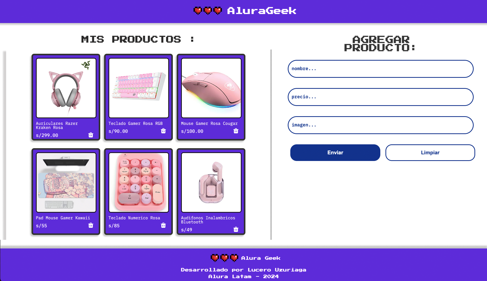

<h1 align="center"> ALURA GEEK </h1>



# Biblioteca Alura Geek

¡Bienvenidos al repositorio de la Biblioteca Alura Geek! Este proyecto es una página web diseñada para una tienda comercial, con un enfoque en una estructura clara y un diseño moderno utilizando la metodología de API Fake

## Tecnologías Utilizadas

- **HTML**: Utilizado para estructurar el contenido de la página web.
- **CSS**: Utilizado para estilizar y dar formato a la página web.
- **JavaScript**: Utilizado para añadir interactividad y dinamismo a la página web.
- **JSON**: Utilizado para manejar datos estructurados y simular APIs durante el desarrollo.
- **Vercel**: Utilizado para desplegar y alojar la página web.

## Tabla de Contenidos

- [ConexionApi]
- [MostrarProducto]
- [AccionFormulario]

## Instalación

Para comenzar con este proyecto, clona el repositorio a tu máquina local y abre el archivo `index.html` en tu navegador.

```bash
git clone https://github.com/luuzuriaga/AluraGeek.git

